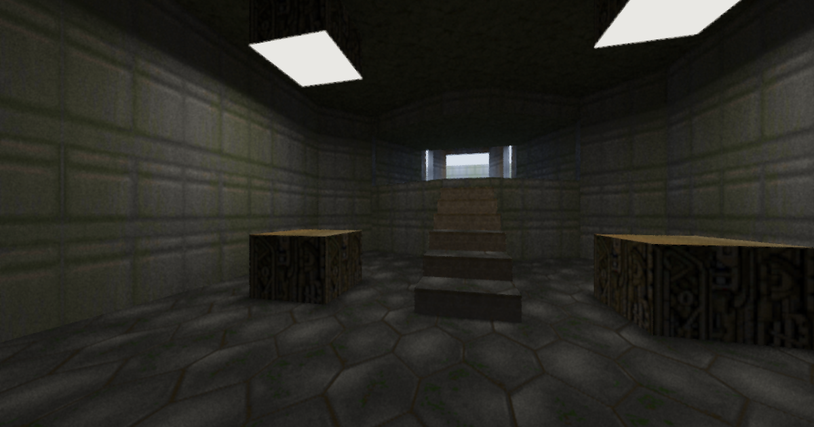

# WebGPU Path Tracer

A real-time path tracer built with WebGPU compute shaders, packaged as a `<path-tracer>` web component. Features BVH-accelerated ray tracing, multiple importance sampling, temporal reprojection, and spatial denoising.



## Getting Started

```bash
npm install
npm run dev
```

Requires a browser with WebGPU support (Chrome 113+, Edge 113+).

## Usage

Add the component to any HTML page:

```html
<script type="module" src="/src/main.ts"></script>

<!-- With built-in controls panel -->
<path-tracer controls></path-tracer>

<!-- Headless, custom settings -->
<path-tracer scene="dungeon" samples="8" bounces="5" resolution="0.5"></path-tracer>

<!-- Programmatic control -->
<script>
  const el = document.querySelector('path-tracer');
  el.setAttribute('samples', '16');
  el.setAttribute('scene', 'bvh');
</script>
```

## `<path-tracer>` Web Component

A self-contained WebGPU path-traced renderer packaged as a custom HTML element. Encapsulates all GPU initialization, scene loading, camera controls, and the render loop inside a shadow DOM. On startup it renders 3 warmup frames (enough for temporal filter convergence), then pauses with a dimmed canvas and a play button overlay. Clicking play starts continuous rendering.

### Attributes

All attributes are optional. When omitted, the default value is used.

#### General

| Attribute | Type | Default | Description |
|-----------|------|---------|-------------|
| `width` | number | `1280` | Canvas width in pixels |
| `height` | number | `800` | Canvas height in pixels |
| `controls` | boolean | _(absent)_ | When present, renders the built-in settings panel over the top-right of the canvas |
| `scene` | string | `doom` | Active scene: `doom` (Doom E1M1), `dungeon` (tile-based dungeon crawler), or `bvh` (BVH teaching demo) |

#### Rendering

| Attribute | Type | Default | Range | Description |
|-----------|------|---------|-------|-------------|
| `samples` | number | `4` | 1-64 | Samples per pixel per frame |
| `bounces` | number | `3` | 1-10 | Maximum path tracing bounces |
| `resolution` | number | `1.0` | 0.25, 0.5, 0.75, 1.0, 2.0 | Render resolution scale (1.0 = native, 2.0 = supersampled) |
| `temporal` | number | `1` | 0-5 | Temporal reprojection frames (0 = off) |
| `denoise` | string | `atrous` | `off`, `median`, `adaptive`, `atrous` | Spatial denoising algorithm |
| `denoise-passes` | number | `1` | 1-5 | Number of denoising passes (ignored when denoise is `off`) |

#### BVH Debug Visualisation

| Attribute | Type | Default | Range | Description |
|-----------|------|---------|-------|-------------|
| `debug-mode` | number | `0` | 0-4 | 0=off, 1=traversal heatmap, 2=BVH depth, 3=leaf triangle count, 4=AABB wireframe |
| `debug-opacity` | number | `100` | 0-100 | Debug overlay opacity percentage (0 = scene only, 100 = debug only) |
| `debug-window` | boolean | _(absent)_ | - | When present, shows debug visualisation in a scaled window in the top-left corner instead of fullscreen |
| `debug-depth` | number | `3` | 0-20 | BVH depth level for wireframe mode |

#### Dungeon-Specific

These only take effect when `scene="dungeon"`.

| Attribute | Type | Default | Range | Description |
|-----------|------|---------|-------|-------------|
| `player-light` | number | `17` | 0-20 | Player torch light intensity (0 = off) |
| `player-falloff` | number | `17` | 1-20 | Torch radius / falloff size |
| `render-distance` | number | `10` | 2-10 | View distance in tiles (changing triggers BVH rebuild) |
| `phantom` | boolean | _(present)_ | - | When present, spawns an animated phantom enemy. Remove attribute to hide it |

### Behaviour

- **Startup**: Initialises WebGPU, loads all three scenes in parallel, renders 3 frames, then pauses. The canvas dims and a centred play button (white triangle in a solid black circle) appears.
- **Play**: Clicking the play button (or anywhere on the overlay) starts continuous rendering.
- **Reactive attributes**: Changing any attribute at runtime updates the renderer immediately. Some changes (`scene`, `resolution`, `render-distance`) trigger a full renderer rebuild; others are applied on the next frame.
- **Boolean attributes**: Follow HTML convention -- presence means true, absence means false. Use `setAttribute('phantom', '')` to enable or `removeAttribute('phantom')` to disable.
- **Controls panel**: The `controls` attribute adds an interactive settings panel in the top-right corner. Controls are two-way bound to attributes -- changing a slider updates the attribute, and changing an attribute updates the slider.
- **Keyboard/mouse**: WASD to move, Q/E to rotate, Space/Shift for up/down. Click canvas to capture mouse for mouselook. ESC to release.

### Scenes

| Value | Description |
|-------|-------------|
| `doom` | Doom E1M1 level parsed from WAD file with texture atlas. FPS camera with collision detection. Requires `/wads/DOOM1.WAD` served from the host. Falls back to a Cornell box if the WAD is missing. |
| `dungeon` | Procedural tile-based dungeon with wall torches, texture atlas, and an animated phantom enemy. Grid-locked camera movement. Requires `/heretic64x64.png` served from the host. |
| `bvh` | Teaching scene with well-separated objects, a dense cluster, nested boxes, a diagonal slab, and a floor grid -- designed to demonstrate BVH traversal behaviour. Free-flying camera. |

## Architecture

```
src/
├── main.ts                  # Imports and registers the web component
├── path-tracer.ts           # <path-tracer> custom element
├── renderer.ts              # WebGPU resource management, render pipeline
├── camera.ts                # FPS camera controller
│
├── bvh/
│   ├── builder.ts           # BVH construction (SAH)
│   └── types.ts             # BVH node types
│
├── doom/
│   ├── wad-parser.ts        # Doom WAD file parser
│   ├── level-converter.ts   # WAD level → triangles/materials
│   ├── textures.ts          # WAD texture extraction & atlas
│   └── collision.ts         # Doom level collision detection
│
├── scene/
│   ├── geometry.ts          # Shared types (Triangle, Material, SceneData)
│   ├── dungeon.ts           # Procedural dungeon scene
│   ├── dungeon-camera.ts    # Tile-based dungeon camera
│   ├── phantom.ts           # Animated phantom enemy
│   └── bvh-teaching.ts      # BVH teaching demo scene
│
└── shaders/
    ├── raytrace.wgsl        # Path tracing compute shader (MIS, BVH debug)
    ├── denoise.wgsl         # Spatial denoising (a-trous/median/adaptive)
    └── temporal.wgsl        # Temporal accumulation shader
```

## Rendering Pipeline

1. **Path trace** (compute shader) -- casts rays per pixel with configurable samples and bounces. Uses BVH traversal with a hot/cold triangle buffer split for cache efficiency. Diffuse bounces use one-sample MIS with balance heuristic for light sampling.
2. **Temporal reprojection** (compute shader) -- reprojects the previous frame using camera matrices and blends with the current frame.
3. **Spatial denoise** (compute shader) -- applies the selected denoising algorithm over configurable passes.
4. **Display** (render pass) -- tonemaps and blits the result to the canvas.

## License

The code here is MIT license.

However the Doom shareware WAD is included and copyright remains with the holders.
